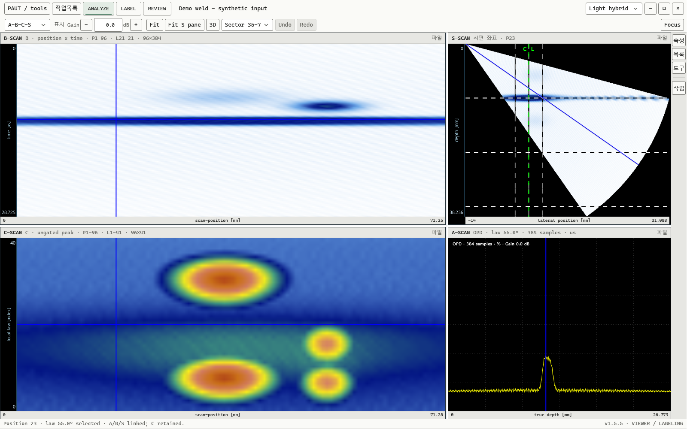

# PAUT AI

## 신호를 읽고, 판단의 근거를 남기다.

PAUT AI는 Windows용 PAUT 검사 시각화·라벨링 작업 공간입니다. 연결된 스캔으로 신호의 맥락을 살피고, 원본 취득 위치를 기준으로 라벨을 검토하고 저장합니다. 최종 판단은 검사자에게 남습니다.

[제품 소개 페이지](https://hyunjjun07.github.io/paut-ai-showcase/) · [기술 범위와 FAQ](TECHNICAL.md) · [공개 소개 저장소](https://github.com/hyunjjun07/paut-ai-showcase)



**실제 앱 렌더링입니다.** 공개용 합성 데모 입력을 사용했으며 현장 검사 결과나 고객 데이터가 아닙니다.

## 실제 화면으로 탐색하는 제품 시연

- [연결 스캔](https://hyunjjun07.github.io/paut-ai-showcase/?scene=scan#product-tour): 선택 위치가 바뀌는 실제 A/B/C/S 장면을 확인합니다.
- [라벨 검토](https://hyunjjun07.github.io/paut-ai-showcase/?scene=label#product-tour): 편집 전, 초안, 명시적인 저장 후 화면을 살펴봅니다.
- [3D 탐색](https://hyunjjun07.github.io/paut-ai-showcase/?scene=volume#product-tour): 실제 렌더러가 다른 카메라 각도에서 만든 화면을 탐색합니다.

스크롤에 맞춰 장면이 이어지며, 버튼과 슬라이더로 직접 선택할 수도 있습니다.
재생을 일시정지하거나 원본 화면을 확대해서 볼 수 있습니다.
모션 감소 설정에서는 자동 재생 없이 수동으로 탐색합니다.
장면을 재생하는 웹 시연이며, 브라우저가 Windows 앱을 실행하거나 신호를 새로 계산하지는 않습니다.

## 하나의 신호, 연결된 시야

- **다섯 가지 native 입력 계열.** NDE, UVDATA, CIVA 프로젝트, OPD, ODAT를 지원합니다. 호환 범위는 포맷 버전과 원본 메타데이터에 따라 달라집니다.
- **연결된 A/B/C/S 스캔.** 선택한 위치의 커서를 각 스캔에 연결해 신호를 여러 시야에서 확인합니다.
- **의미를 구분하는 3D.** Physical은 기하와 반사 경로를 반영한 표현, Unfolded는 전개 표현, native P/L/S는 취득 인덱스 공간입니다. 서로 같은 좌표계가 아닙니다.
- **원본을 보존하는 표시 Gain.** 팔레트의 진폭 기준만 조절합니다. 원본 표본과 측정값은 바뀌지 않습니다.

## 검토에서 저장까지, 사람의 결정으로

1. 검사 파일을 열고 연결할 라벨 파일을 새로 만들거나 엽니다.
2. 한 검사 파일에 속한 여러 라벨을 목록으로 확인하고, 각 라벨의 신호 위치로 이동합니다.
3. 초안을 검토한 뒤 **라벨 추가·저장** 또는 **변경 저장**으로 반영합니다.
4. 파일별 작업목록과 파일 내 라벨 이동으로 다음 검수 대상을 정리합니다.

신호를 탐색하는 것과 라벨을 확정하는 것은 별개의 단계입니다. AI 후보도 검사자의 확인을 거쳐야 합니다.

## 연구용 AI 보조는 선택 사항입니다

연구용 AI 보조는 후보를 생성하고 해당 신호로 이동하는 데 사용합니다. 사용 동의와 별도의 모델·실행 환경 구성이 필요합니다. 후보는 확정 결함이나 합격·불합격 판정이 아니며, AI 결과가 라벨로 자동 저장되지는 않습니다.

## 이 공개 저장소에 담긴 것

제품 소개 페이지, 실제 앱 시연 이미지와 공개 문서만 담습니다. **앱 소스는 비공개 독점 소프트웨어로 유지되며, 앱 설치 프로그램과 AI 모델 패키지는 이 저장소에서 제공하지 않습니다.** 저장소 공개는 앱의 오픈소스 라이선스나 사용권을 뜻하지 않습니다.

소개 페이지는 브라우저에서 읽는 정적 페이지입니다. 검사 파일 분석과 라벨 편집은 Windows 데스크톱 앱에서 수행합니다.

## 패키지 설치 없이 로컬 미리보기

공개 소개 저장소를 내려받은 뒤 `index.html`을 브라우저로 여세요. 앱이나 npm 패키지를 설치할 필요가 없습니다.

로컬 HTTP로 확인하려면, Python이 설치된 환경에서 `index.html`이 있는 폴더를 열고 실행합니다. Python 표준 라이브러리만 사용합니다.

```console
python -m http.server 8000 --bind 127.0.0.1
```

브라우저에서 `http://127.0.0.1:8000/`을 열고, 확인이 끝나면 터미널에서 `Ctrl+C`로 종료합니다. 이 명령은 소개 페이지를 띄울 뿐 검사 데이터를 분석하지 않습니다.

## English summary

PAUT AI is a Windows desktop workspace for linked PAUT scan review and human-controlled labeling. Optional research AI assistance needs separate model and runtime setup; its candidates aren't final inspection decisions. This repository contains presentation assets only, not the proprietary application, an installer, or AI model packages.
